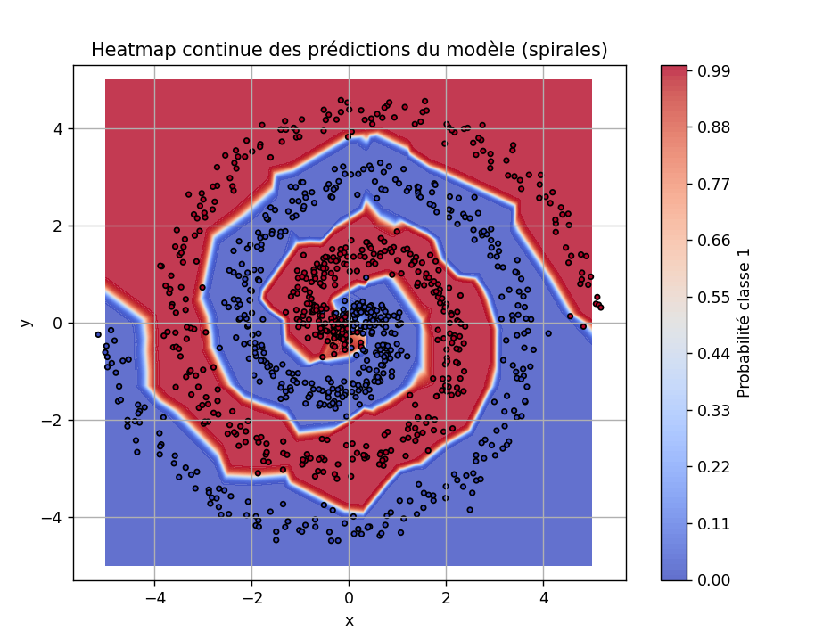
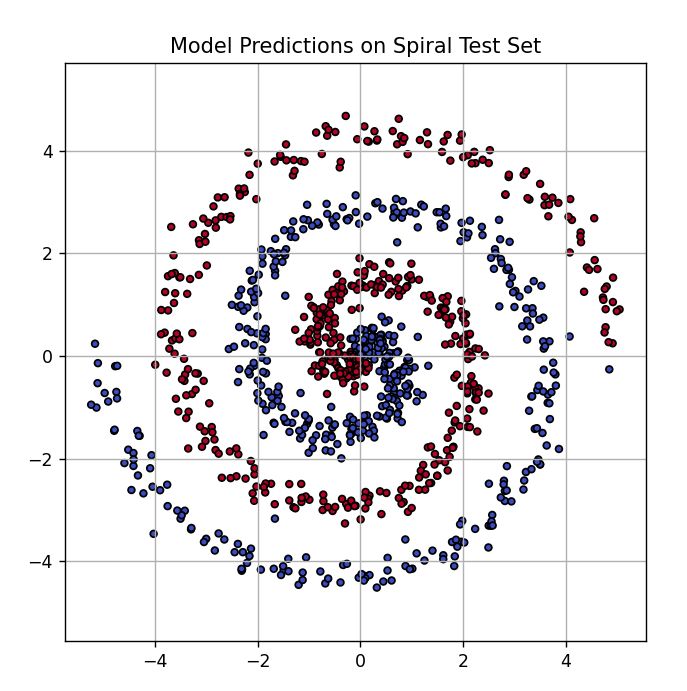

# 🧠 Spiral Neural Network Classifier (PyTorch)

This is a personal project showcasing how to build, train, and evaluate a neural network using PyTorch to classify points from two intertwined spirals — a well-known non-linear classification problem.

---

## 🚀 What This Project Includes

- Generation of a synthetic spiral dataset
- Custom neural network model built in PyTorch
- Binary classification with ReLU output
- Training loop with loss plotting
- Model evaluation and accuracy computation
- Visualizations of:
  - Data distribution
  - Decision boundary heatmap
  - Predicted labels

---

## 📸 Visual Results

### 🔥 Spiral Decision Boundary Heatmap
This image shows how the model separates the space between the two spirals:

---

### 🎯 Model Predictions on Spiral Dataset
Each point is colored according to the class predicted by the model:

---

## ▶️ How to Run

### 1. Install dependencies:

    pip install -r requirements.txt

### 2. Train the model:

    python train.py

Model weights will be saved to `saved_model/spiral_model.pth`.

### 3. Evaluate the model:

    python test.py

You will see classification accuracy and a plot of predicted spiral classes.

### 4. Visualize decision boundary:

    python decision_boundary.py

This will generate a heatmap showing how the model separates the spirals.

---

## 📌 Technologies Used

- PyTorch
- Matplotlib
- Python 3.10+

The trained model (`.pth` file) is included and was trained entirely from scratch on synthetic data.
